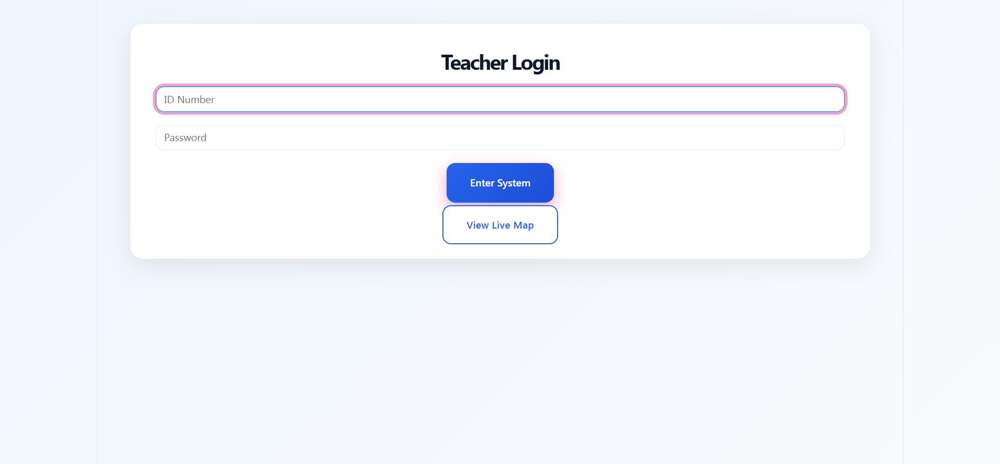
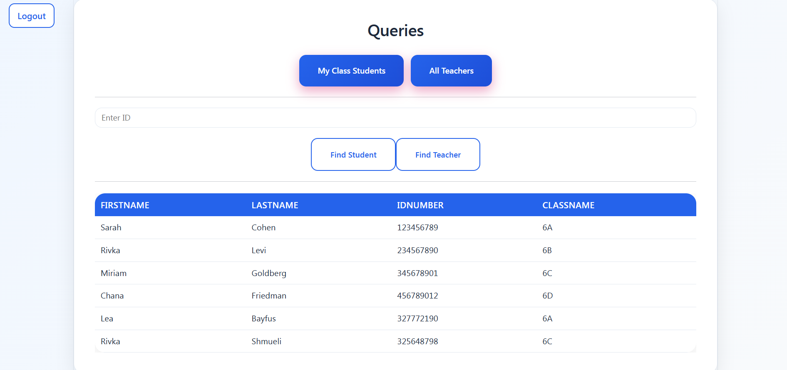
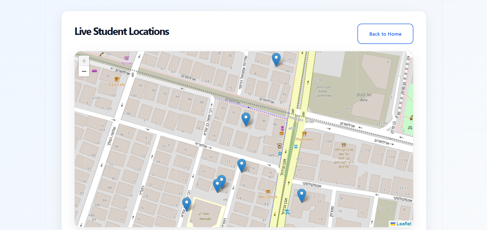
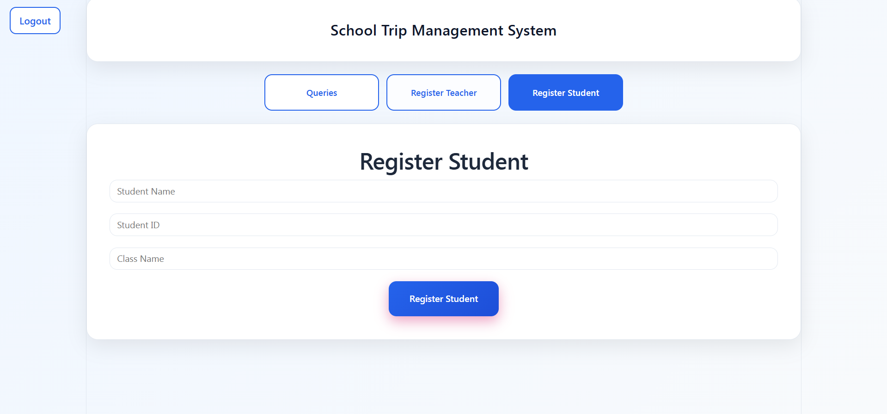
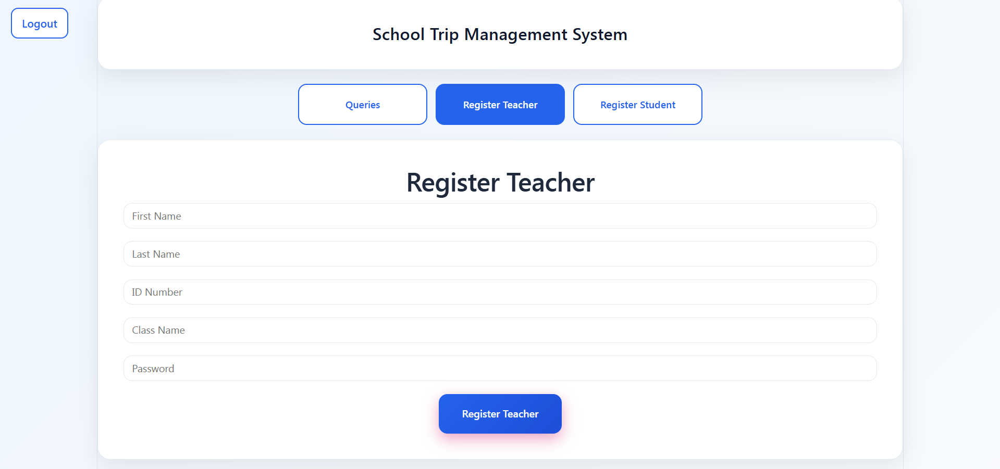

# Annua School Trip Management System

A real-time student tracking system for managing school trips.
The system includes teacher authentication, student management, queries, and live location tracking on a map.

# Tech Stack

- Node.js + Express (Backend)
- MongoDB (Database)
- React + Vite (Frontend)
- Leaflet (Interactive Map)
- REST API

# Project Structure

project/
│
├── server/ # Backend (Node.js + Express)
│ ├── app.js
│ ├── routes/
│ ├── models/
│ ├── middlewares/
│ ├── simulation/
│ └── utils/
│
├── client/ # Frontend (React)
│ ├── src/
│ └── package.json


# How to Run the Project?
## 1. Run the Server

Inside the `server` folder:

```bash
node app.js
```

The server runs on:

```bash
http://localhost:5000
```

## 2. Run the Client

Inside the client folder:

```bash
npm install
npm run dev
```

The frontend runs on:

```bash
http://localhost:5173
```

## 3. Run Location Simulation (Optional)

Inside the server folder:

```bash
node locationSimulator.js
```

This script simulates real-time movement of students and continuously updates their locations in the database.

# Main Features
- Teacher login system
- Student management by class
- Query system:
- All students in class
- All teachers
- Search by ID
- Live map with student locations
- Real-time location updates
- Automatic database updates from simulator

# Screenshots

### Login Page


### Dashboard


### Map


### Register Student


### Register Teacher


#Notes
- Authentication is handled using JWT
- Map updates automatically every few seconds
- Each student is identified by studentId
- Only the latest location per student is displayed

